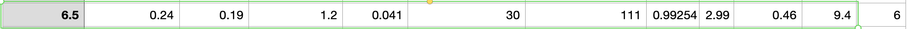

```{r setup, include=FALSE}
knitr::opts_chunk$set(echo = TRUE)
```

# Introduction
Nowadays, wine has become an essential drink for people to relieve stress, party, and socialize. A good bottle of wine can bring people closer together through sharing and quickly give them something to talk about in common. Whenever you are going to visit someone, wine is one of the best gifts. But drinking doesn't mean knowing how to buy wine. Giving the right wine will have a bad social effect if you don't provide the right wine. Generally speaking, wine is usually rated on a scale of scores. The price of a bottle of wine that has been scored can be several times more expensive than before it was scored. Those who don't have enough money may need to pick the best wine at the right price from the unscoring wines to achieve their social purpose. In this paper, the prediction of wine ratings is a good solution to this problem as long as each variable is entered into the model accordingly, the model can successfully predict the final rating of the wine.

We will show our model in the following aspects:1 Data & Packaging Loading, 2 Data Exploratory Analysis, 3 Experiment, 4 Test Case Study, 5 Conclusion & Future work. 

# Data & Packaging Loading 

## Package Loading

All packages we used for this project
```{r}
#import package
suppressMessages(library(klaR) )
suppressMessages(library(tidyverse))
suppressMessages(library(tidymodels))
suppressMessages(library(corrplot))
suppressMessages(library(discrim))
library(poissonreg)
library(corrr) 
tidymodels_prefer()
library(lubridate)
library(skimr)
library(patchwork)
library(janitor)
library(tune)
set.seed(123) # can be any number
```


## Dataset Breakdown & Explanation

We use the data from [dataset](https://archive.ics.uci.edu/ml/datasets/wine+quality). Specifically, we use the white wine as our study's dataset. more detail will be displayed in codebook. 

1 Fixed acidity: most acids involved with wine or fixed or nonvolatile (do not evaporate readily)

2 Volatile acidity: the amount of acetic acid in wine, which at too high of levels can lead to an unpleasant, vinegar taste

3 Citric acid: found in small quantities, citric acid can add ‘freshness’ and flavor to wines

4 Residual sugar: the amount of sugar remaining after fermentation stops, it’s rare to find wines with less than 1 gram/liter and wines with greater than 45 grams/liter are considered sweet

5 Chlorides: the amount of salt in the wine 

6 Free sulfur dioxide: the free form of SO2 exists in equilibrium between molecular SO2 (as a dissolved gas) and bisulfite ion; it prevents microbial growth and the oxidation of wine

7 Total sulfur dioxide: amount of free and bound forms of S02; in low concentrations, SO2 is mostly undetectable in wine, but at free SO2 concentrations over 50 ppm, SO2 becomes evident in the nose and taste of wine

8 Density: the density of water is close to that of water depending on the percent alcohol and sugar content

9 pH: describes how acidic or basic a wine is on a scale from 0 (very acidic) to 14 (very basic); most wines are between 3-4 on the pH scale

10 Sulphates: a wine additive which can contribute to sulfur dioxide gas (S02) levels, wich acts as an antimicrobial and antioxidant

11 Alcohol: the percent alcohol content of the wine

12 Quality: output variable (based on sensory data, score between 0 and 10)

## Source Data Laoding

```{r}
data <- read_csv("data/final_wine.csv") %>% 
  clean_names()
head(data)
```


# Data Exploratory Analysis

In this section, we perform some data exploratory analysis on the entire dataset to get the relationship and patterns of varibles.

## Checking missing vlaue

It is important to check if there is any missing value and to check each variable type in the dataset before we start to do the EDA. From the below result, we can confirm there is no missing value, and all variables are numeric. 

```{r}
cat('number of missing value is ', sum(is.na(data)))
data %>% 
    summarise_all(typeof) %>%
     gather
```

## Summary for Each Variable 

From this summary table, we can see the mean residual sugar level is 6.391, but there is a sample of very sweet wine with 65.800, which is almost 10 times the mean. It might be considered an outlier. But From the outlier, we see the higher residual sugar, the higher free sulfur dioxide. We will see if there is just an outlier or if there is a relationship between those two variables. 

```{r summary data}
summary(data)
```

## Dataset Quality Grade breakdown

In the below figure, wine are most likely has quality grade 5 and 6. There are only few really low grade(3) and high grade(9) exist. we consider the quality is a normal distribution by look at the bar plot. 
```{r Q result bar chart}
table(data$quality)
data %>% 
  ggplot(aes(x = quality)) +
  geom_bar()
```


## Alcohol Content Distribution

In the below Figure, the percent alcohol content of the wine is the number people usually care about. The histogram looks skewed left. Most white wine has 9%-9.5% alcohol. And wine has 8.5% ~11.5% of alcohol are the majority which is pretty similar to what we see in the market. 

```{r hist of }
hist(data$alcohol, main = 'Alcohol Content Distribution')
```

## Distribution for all Independent Variables 

After we see the distibution of alcohol content, it's time to show the histogram of all input (independent) variables shown below, we notice that Density, fixed_acidity and pH are almost normally distributed, and the rest are positively skewed.

```{r}
suppressMessages(library(Hmisc))
indepent_data_frame <- data %>%
  select(-quality)
hist.data.frame(indepent_data_frame)
```

## Ralationship Between Volatile Acidity and Quality Grade

Volatile acidity at too high of levels can lead to an unpleasant vinegar taste. So we can assume people don't like a wine to taste like vinegar. So higher volatile acidity may cause low quality(grade) because people dislike it. This graph shows, except for quality grades 3 and 9 (sample too small), the lower quality, the relatively higher volatile acidity. The analysis result is in line with our assumption. 

```{r}
library(ggthemes)

data %>%
 ggplot() + geom_boxplot(mapping = aes(x = quality, y = volatile_acidity,group=quality)) + geom_jitter(mapping = aes(x = quality, y = volatile_acidity,group=quality), alpha = 0.05, height = 0) + theme_gdocs() + 
  labs(x = "quality", y = "volatile.acidity")+
  coord_flip()
```

## Ralationship Between Alcohol and Quality Grade

Except quality grade 3(not enough data), higher quality wine have higher percent of alcohol in it. Quality 5 is a exception, we can dig into it in the future if we have more information such as year of wine, locaton where the wine prodiced. Also, It will be interesting to compare the result to various varieties of liquor to see if the trend is similar in the future. 

```{r}
data %>% 
  ggplot(aes(x = quality, y = alcohol, group = quality)) +
  geom_boxplot() +
  xlab('quality') +
  ylab("percent of alcohol")
```

## Residual Sugar & Quaility

From below figue, we can see the higher quality (7, 8) wine has relatively low residual sugar. Grade 4 is showing a different pattern. We could dig into this part in the future when we have more information, such as location, the year the wine was produced, etc.

```{r}
data %>%
 ggplot() + geom_boxplot(mapping = aes(x = quality, y = residual_sugar,group=quality)) + geom_jitter(mapping = aes(x = quality, y = residual_sugar,group=quality), alpha = 0.1, height = 0) + theme_gdocs() + 
  labs(x = "quality", y = "residual_sugar")+
  coord_flip()
```

## PH value Breakdown by Quality

Higher quality grade wine has relatively higher pH value (can't be really high since too high pH wines are more susceptible to bacterial growth.). Because Low pH wines will taste tart and crisp, we can assume people don't like wine taste crisp and grade the low-pH wine lower. The chart shows our assumption is correct. 

```{r}
ggplot(data, aes( p_h)) +
  geom_histogram(bins = 20, color = "white") +
  facet_wrap(~quality, scales = "free_y") +
  labs(
    title = "PH value Breakdown by Quality"
  )
```

##  residual_sugar with density

We want to dig into the relationship between sugar and density. Since the sugar will affect the wine density (according to wine exerts said), we expect there is a relationship between sugar and density. Here, we are trying to check the relationship between this variable and see if there is a clear trend. The first graph shows the relationship between residual_sugar with density in all observations. The second graph is we removed the outlier. We can see a kinda linear trend here. A higher residual of sugar will cause higher density(after we remove the outliers).  

```{r}
ggplot(data, aes(x= residual_sugar, y = density)) + geom_point() + geom_smooth()

df_remove_outlier <- filter(data, residual_sugar <  25)
ggplot(df_remove_outlier, aes(x= residual_sugar, y = density)) + geom_point() + geom_smooth()

```

## Correlation 
It is time to check the relationship among the independent variables after we compare the specific pairs. By looking at the figure below, we can conclude that:

1: Fixed.acidity has a strong positive correlation with citric_acid and density, and strong negative correlation with pH.

2: residual_sugar has strong positive relation with free_sulfur_dioxide, total_sulfur_dioxide and density and negative relation with alcohol.

3: Citric_acid has slightly negative correlation with volatile.acidity and pH.

4: Alcohol is loosely negatively correlated to density, free_sulfur_dioxide, total_sulfur_dioxide, chlorides and residual_sugar and has positive correlated to quality.

```{r}
data %>%  select(where(is.numeric)) %>% 
  cor(use = "complete.obs") %>% 
  corrplot()
```


# Experiment

In this section, we show our experimental step including data split, cross validation setup,recipe setup, modeling setup & implementation details, and fit the best model & tests.

## Data Split

In this subsection, we split the data with 70% on training and 30 % on test. It will gives us 3427 observations on trainning dataset and 1471 observations on testing dataset. 
```{r data_split}
set.seed(1234)
data_split <- data %>% 
  initial_split(prop = 0.7, strata = quality)

data_train <- training(data_split)
data_test <- testing(data_split)
dim(data_train)
dim(data_test)
```

## Cross Validation

After splitting the data, we use cross validation to fold the training data into 10 folds with 5 repeats.

```{r}
set.seed(1234)
data_folds <- vfold_cv(data = data_train, v = 10, strata = quality,repeats = 5)

```

## Add recipe

since all variables are numeric, we don't need to do extra steps for recipe.

```{r}
data_recipe <- recipe(quality ~ ., data =data_train)
data_recipe
```

## Model setup & Inplementaton Deatails

### linear regression 

we set up a linear regression workflow and fit in the data to check the rmse performance
```{r}
lm_model <- linear_reg() %>% 
  set_engine("lm")


lm_wkflow  <- workflow() %>% 
  add_recipe(data_recipe) %>% 
  add_model(lm_model)


lm_fit <- fit_resamples(lm_wkflow, data_folds)
```

## Linear performance

We find the minimum rmse here is 0.703.

```{r}
bind_rows(lm_fit$.metrics)
```


### Random Forest Model

In this section, we use random forest to train the data. Since the training process take too long to tune the number of trees, we are not going to tune trees. we use min_n(range= c(2,20)),mtry(range= c(1,11)), levels = 2 as tuning range.

```{r echo = FALSE}
rf_model <- 
  rand_forest(
              min_n = tune(),
              mtry = tune(),
              mode = "regression") %>% 
  set_engine("ranger")

rf_workflow <- workflow() %>% 
  add_model(rf_model) %>% 
  add_recipe(data_recipe)


```

We get and tune the result for random forest. 

```{r echo = FALSE}
rf_grid <- grid_regular( min_n(range= c(2,20)),mtry(range= c(1,11)), levels = 2)
rf_tune <- rf_workflow %>% 
  tune_grid(
    resamples = data_folds,
    grid = rf_grid)
```

we see the the randomly selected predictiors are larger, the model is better. 
```{r}
autoplot(rf_tune)
```

### XG Boost Tree

we apply a XG boost model here. we use trees = 5000 and depth =4 here

```{r}
bt_model <- boost_tree(trees = 5000, tree_depth = 4) %>% 
  set_engine("xgboost") %>%
  set_mode("regression")

bt_workflow <- workflow() %>% 
  add_model(bt_model %>% set_args(trees = tune())) %>%
  add_recipe(data_recipe)
```

we get the tunning result here (trees range from 10-2000,levels = 10).

```{r echo=FALSE}
bt_grid <- grid_regular(trees(range = c(10,2000)), levels = 10)
bt_tune <- tune_grid(
  bt_workflow,
  resamples = data_folds,
  grid = bt_grid,
  metrics = metric_set(rmse)
)

```

We can see tree number is around 250 has the best(loest) rmse.
```{r}
autoplot(bt_tune)
```

## Nearest Neighbors

Lastly, I ran repeated cross fold validation on the Nearest Neighbor model here. 
```{r}
knn_model <- 
  nearest_neighbor(
    neighbors = tune(),
    mode = "regression") %>% 
  set_engine("kknn")

knn_workflow <- workflow() %>% 
  add_model(knn_model) %>% 
  add_recipe(data_recipe)
```
Again, we got the tunning result here. 
```{r}
#tuning grid
knn_params <- parameters(knn_model)
#define grid 
knn_grid <- grid_regular(knn_params, levels = 2)
knn_tune <- knn_workflow %>% 
  tune_grid(
    # what will it fit the workflow to
    resamples = data_folds, 
    # how does it complete the models in those workflows
            grid = knn_grid)
```

below shows that the idea number of neighbors is 15. we can get proved by print it out in the next section. 
```{r}
autoplot(knn_tune)
```


## Model Evaluation by Using rmse

Here we show all three model tuning result with rmse here. 
```{r}
show_best(rf_tune, metric = "rmse") %>% select(-.estimator, -.config)
show_best(bt_tune, metric = "rmse") %>% select(-.estimator, -.config)
show_best(knn_tune, metric = "rmse") %>% select(-.estimator, -.config)
```

## Model Selection

Since the best rmse for linear regression is 0.703, random forest is 0.63, xgboost is s0.88, knn is 0.70. We will choose random foreset as our final model to train since it has the lowest rmse.

```{r}
rf_workflow_tuned <- rf_workflow %>% 
  finalize_workflow(select_best(rf_tune, metric = "rmse"))
```

We fit the trainning dataset with our random forest model again.
```{r}
#fit in data 
final_model <- fit(rf_workflow_tuned, data_train)
```

## Best Model & Test Result Anlaysis

We use our final best model to train on test dataset. Below, we shows the final result of our random forest rmse performance on test dataset. the result 0.5999 is slightly better than the traning result 0.6352. 
```{r}
data_metric <- metric_set(rmse)

model_test_predictions <- predict(final_model, new_data = data_test) %>% 
  bind_cols(data_test %>% select(quality)) 

model_test_predictions %>% 
  data_metric(truth = quality, estimate = .pred)
```

# Test Case Study

Let's fit in a wine with a wine: fixed acidity 6.5,	volatile acidity 0.24,	citric acid	0.19, residual sugar 1.2,	chlorides 0.041,	free sulfur dioxide 30,	total sulfur dioxide 111,	density 0.99254,	pH 2.99, sulphates 0.46,	alcohol 9.4.
```{r}
new_data <- tibble(fixed_acidity = 6.5, volatile_acidity= 0.24,	citric_acid=	0.19, residual_sugar=1.2,	chlorides= 0.041,	free_sulfur_dioxide= 30,	total_sulfur_dioxide =111,	density =0.99254,	p_h =2.99, sulphates =0.46,	alcohol= 9.4)
round(predict(final_model, new_data = new_data))
```

From Above figure, we see the prediction 6 matches up with the true value.


# Conclusion & future work

In this study, we used four models: Linear regression, random forest, xgboost, and knn, to make a wine quality prediction. The final result mse is 0.5999 from the random forest, considered the best model among the four models. We also show a case study to predict wine quality successfully. Random forest may because of each tree representing a sample from the data, the uncorrelated trees were able to protect themselves from making correlations between variables that were not actually correlated. Xgboost and % knn perform similarly. The linear regression is the worst but make sense sicne it only holds linear ralationships. the future, we can consider making more complex models or developing and collecting more variables for the dataset to improve the predicted result. In the future steps, we can also make a automatically wine grading system to make recommendation for potentially clients.  
